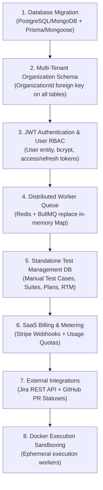

# AI QA Automation Platform — Comprehensive Codebase Verification Audit

> **Audit Date:** August 23, 2026  
> **Audited Target:** `D:\Learning\qa-platform` (`qa-backend` and `qa-test-execution-dashboard`)  
> **Execution Constraint:** Static verification only — **0 source code modifications performed**.

---

## Executive Summary & Realistic Completion Metrics

The previous feature audit estimated platform completeness at ~45%. Following an exhaustive line-by-line verification of the codebase, that estimate has been recalibrated based on production & SaaS commercial requirements:

* **Engineering Codebase Completion:** **35%** (Solid test execution, accessibility, live logging, and failure analysis foundations exist, but core platform capabilities are unbuilt).
* **MVP Functional Completion:** **40%** (Sufficient for local single-user Playwright BDD runs & WCAG scans, but lacks standalone manual test case management, Jira, and scheduling).
* **SaaS Multi-Tenant Readiness:** **0%** (Zero tenant isolation, organization models, user databases, or payment gateways exist).
* **Production Deployment Readiness:** **15%** (Monolithic file-system storage, in-memory process maps, lack of user auth/RBAC, and lack of Docker execution sandboxing block production deployment).

---

## Detailed Architectural Analysis

### 1. Current Architecture Overview

The platform currently operates as a decoupled two-tier monolith:
* **Presentation Tier:** Angular 19 SPA (`qa-test-execution-dashboard`) using RxJS, Angular Material, and Socket.IO client.
* **Backend Microservice / Monolith Tier:** Node.js/Express server (`qa-backend/index.js`, 1886 lines) handling REST endpoints, Socket.IO events, Cucumber child process spawning, Playwright browser orchestration, and Deque Axe Core accessibility scanning.
* **Storage Tier:** Local filesystem JSON storage (`data/projects.json`, `data/features.json`) and static directory asset serving (`artifacts/`).

### 2. Backend Architecture

* **Framework:** Node.js, Express 5, Socket.IO 4.
* **Execution Strategy:** Spawns `@cucumber/cucumber` as child processes via Node `child_process.spawn`.
* **Browser Automation:** Direct Playwright API (`playwright` 1.59) managing Chromium, Firefox, WebKit engines.
* **State Management:** In-memory `Map` objects (`activeProcesses`, `executionStatuses`). State is volatile and lost upon server restart.

### 3. Frontend Architecture

* **Framework:** Angular 19 (Standalone Components).
* **UI Theme:** Space Slate Glassmorphic Theme (`styles.scss`) with responsive navbar, sidebar drawer, and dark mode styling.
* **Key Modules:** Launch Center (`/launch`), Executive Dashboard (`/dashboard`), Live Log & Execution Runner (`/execution`), Execution Detail Modal (`/execution-detail`), Accessibility Audits (`/accessibility`), CI/CD Webhooks (`/cicd`), Feature Workspace (`/features`), Project Workspace (`/projects`), Reports & Trends (`/reports`).

### 4. Database & Storage Architecture

* **Database Engine:** **NONE**.
* **Current Storage:** Flat JSON files (`data/projects.json`, `data/features.json`, `data/history/`).
* **Artifact Storage:** File system paths (`artifacts/:executionId/screenshots`, `/videos`, `/traces`, `/accessibility_scans`, `/analysis`).
* **Critical Risk:** No ACID transactions, no concurrency locks, no database indexing, and potential data corruption if simultaneous executions write to JSON files.

---

## Detailed Component & Feature Verification Matrix

---

### 5. Authentication Status

#### Feature 5.1: User Registration, User Database & Password Hashing
* **STATUS:** `MISSING`
* **EVIDENCE:** N/A (No User model, no registration route in `qa-backend/index.js` or `services/`).
* **GAP:** Complete absence of user storage, password encryption (`bcrypt`), and registration APIs.
* **PRIORITY:** `P0`
* **DEPENDENCIES:** PostgreSQL/MongoDB database integration.

#### Feature 5.2: User JWT / OAuth Authentication & Login
* **STATUS:** `BROKEN` (Confused implementation)
* **EVIDENCE:** [`services/session.service.js`](file:///d:/Learning/qa-platform/qa-backend/services/session.service.js) & [`index.js:231`](file:///d:/Learning/qa-platform/qa-backend/index.js#L231)
* **GAP:** The current `/api/sessions/login` endpoint launches Playwright to perform automated web browser login on external sites to save `storageState.json` cookies for test automation. **It is NOT user authentication for the SaaS platform itself.**
* **PRIORITY:** `P0`
* **DEPENDENCIES:** User DB schema & JWT token generation service.

#### Feature 5.3: Session Token Refresh & Expiration
* **STATUS:** `MISSING`
* **EVIDENCE:** N/A
* **GAP:** No access/refresh token lifecycle or session validation middleware.
* **PRIORITY:** `P0`
* **DEPENDENCIES:** Feature 5.2.

---

### 6. Multi-Tenancy Status

#### Feature 6.1: Tenant Data Isolation & Organization Model
* **STATUS:** `MISSING`
* **EVIDENCE:** [`services/project.service.js`](file:///d:/Learning/qa-platform/qa-backend/services/project.service.js)
* **GAP:** All projects and executions are globally accessible. No `organizationId` foreign key or query scoping exists.
* **PRIORITY:** `P0`
* **DEPENDENCIES:** Database ORM / ODM implementation.

#### Feature 6.2: Tenant Workspace & Organization Switcher
* **STATUS:** `MISSING`
* **EVIDENCE:** [`shell-layout.component.ts`](file:///d:/Learning/qa-platform/qa-test-execution-dashboard/src/app/layout/shell-layout.component.ts)
* **GAP:** Frontend has no concept of organization contexts or active workspace switching.
* **PRIORITY:** `P1`
* **DEPENDENCIES:** Feature 6.1.

---

### 7. Role-Based Access Control (RBAC) Status

#### Feature 7.1: Roles & Permissions Matrix (Super Admin, QA Lead, Developer, Viewer)
* **STATUS:** `MISSING`
* **EVIDENCE:** N/A
* **GAP:** No permission checks on any REST endpoint. Any HTTP request can read, modify, or delete features and projects.
* **PRIORITY:** `P0`
* **DEPENDENCIES:** Feature 5.2 & Feature 6.1.

---

### 8. Test Management Status

#### Feature 8.1: BDD Gherkin Feature File Management
* **STATUS:** `VERIFIED`
* **EVIDENCE:** [`services/feature.service.js:1-120`](file:///d:/Learning/qa-platform/qa-backend/services/feature.service.js#L1-L120), [`features-page.component.ts`](file:///d:/Learning/qa-platform/qa-test-execution-dashboard/src/app/pages/features/features-page.component.ts)
* **GAP:** Single `.feature` upload supported. Missing ZIP archive upload and multi-file batch upload.
* **PRIORITY:** `P1`
* **DEPENDENCIES:** Storage Service.

#### Feature 8.2: Standalone Manual Test Case Repository
* **STATUS:** `MISSING`
* **EVIDENCE:** N/A
* **GAP:** No manual test case entity (ID, title, preconditions, steps, expected results, priority, severity). Tests only exist as raw text in Gherkin feature files.
* **PRIORITY:** `P1`
* **DEPENDENCIES:** Database integration.

#### Feature 8.3: Custom Test Suite Hierarchy & Test Plans
* **STATUS:** `PARTIAL`
* **EVIDENCE:** [`launch-center.component.ts`](file:///d:/Learning/qa-platform/qa-test-execution-dashboard/src/app/pages/launch-center/launch-center.component.ts)
* **GAP:** Tag-based dynamic filtering (`@smoke`, `@regression`) works. Static nested test suites, drag-and-drop ordering, and sprint test plans are missing.
* **PRIORITY:** `P1`
* **DEPENDENCIES:** Feature 8.2.

---

### 9. Execution Engine Status

#### Feature 9.1: Cucumber Playwright Test Execution
* **STATUS:** `VERIFIED`
* **EVIDENCE:** [`index.js:913-1015`](file:///d:/Learning/qa-platform/qa-backend/index.js#L913-L1015), [`steps/customer_portal.steps.js`](file:///d:/Learning/qa-platform/qa-backend/steps/customer_portal.steps.js)
* **GAP:** Executed via `child_process.spawn`. Works reliably for single local executions. Edge case: Subprocess leaks if server crashes mid-execution.
* **PRIORITY:** `P0`
* **DEPENDENCIES:** None.

#### Feature 9.2: Execution Mode (Headless vs Interactive) & Browser Pool
* **STATUS:** `VERIFIED`
* **EVIDENCE:** [`services/browser/browser.service.js:1-85`](file:///d:/Learning/qa-platform/qa-backend/services/browser/browser.service.js#L1-L85), [`services/browser/browser-pool.manager.js:1-110`](file:///d:/Learning/qa-platform/qa-backend/services/browser/browser-pool.manager.js#L1-L110)
* **GAP:** Resolves interactive desktop browser vs headless mode smoothly and manages persistent contexts.
* **PRIORITY:** `P0`
* **DEPENDENCIES:** None.

#### Feature 9.3: Real-Time Live Log Streaming
* **STATUS:** `VERIFIED`
* **EVIDENCE:** [`support/socket.js:1-45`](file:///d:/Learning/qa-platform/qa-backend/support/socket.js#L1-L45), [`execution-page.component.ts`](file:///d:/Learning/qa-platform/qa-test-execution-dashboard/src/app/pages/execution/execution-page.component.ts)
* **GAP:** Streams console output, step progress, and status events live to the Angular log terminal.
* **PRIORITY:** `P0`
* **DEPENDENCIES:** None.

#### Feature 9.4: Execution Queue & Process Isolation
* **STATUS:** `PARTIAL`
* **EVIDENCE:** [`index.js:35`](file:///d:/Learning/qa-platform/qa-backend/index.js#L35) (`const activeProcesses = new Map();`)
* **GAP:** In-memory queue only. No distributed job queue (BullMQ/Redis), no worker autoscaling, no Docker sandbox container isolation.
* **PRIORITY:** `P1`
* **DEPENDENCIES:** Redis server.

---

### 10. AI Capabilities

#### Feature 10.1: Modular AI Failure Diagnostics Subsystem
* **STATUS:** `VERIFIED`
* **EVIDENCE:** [`services/ai/failure-analysis/failure-analysis.service.js`](file:///d:/Learning/qa-platform/qa-backend/services/ai/failure-analysis/failure-analysis.service.js), [`services/ai/failure-analysis/registry/rule.registry.js`](file:///d:/Learning/qa-platform/qa-backend/services/ai/failure-analysis/registry/rule.registry.js)
* **GAP:** 11 heuristic rules classify assertion mismatches, auth failures, locator errors, timeouts, 4xx/5xx network errors, and JS exceptions. Generates root causes and confidence scores.
* **PRIORITY:** `P0`
* **DEPENDENCIES:** None.

#### Feature 10.2: AI Deterministic Self-Healing Locators
* **STATUS:** `VERIFIED`
* **EVIDENCE:** [`services/ai/locator-healing/locator-healer.facade.js`](file:///d:/Learning/qa-platform/qa-backend/services/ai/locator-healing/locator-healer.facade.js)
* **GAP:** Multi-pass locator healer with DOM snapshot analysis, candidate generator/scorer/validator, confidence gate, and AI candidate ranker.
* **PRIORITY:** `P0`
* **DEPENDENCIES:** None.

#### Feature 10.3: Requirement to Test Case / Automation Code Generation
* **STATUS:** `MISSING`
* **EVIDENCE:** N/A
* **GAP:** No AI prompt service to convert plain text user stories into Gherkin or Playwright test automation scripts.
* **PRIORITY:** `P1`
* **DEPENDENCIES:** LLM Provider API Integration.

---

### 11. Accessibility

#### Feature 11.1: Automated WCAG 2.1 / 2.2 AA Compliance Audit Engine
* **STATUS:** `VERIFIED`
* **EVIDENCE:** [`index.js:55-150`](file:///d:/Learning/qa-platform/qa-backend/index.js#L55-L150), [`accessibility-page.component.ts`](file:///d:/Learning/qa-platform/qa-test-execution-dashboard/src/app/pages/accessibility/accessibility-page.component.ts)
* **GAP:** Direct integration with `@axe-core/playwright`. Supports live browser audits, compliance filters (WCAG, ADA, Sec 508), weighted score calculation (0-100), and JSON report persistence under `/artifacts/accessibility_scans/`.
* **PRIORITY:** `P0`
* **DEPENDENCIES:** None.

---

### 12. Reporting

#### Feature 12.1: Executive Dashboard & Flaky Test Analytics
* **STATUS:** `VERIFIED`
* **EVIDENCE:** [`index.js:588-700`](file:///d:/Learning/qa-platform/qa-backend/index.js#L588-L700), [`dashboard-page.component.ts`](file:///d:/Learning/qa-platform/qa-test-execution-dashboard/src/app/pages/dashboard/dashboard-page.component.ts)
* **GAP:** Calculates project pass rates, execution duration trends, flaky test statistics, and composite QA Health scores.
* **PRIORITY:** `P0`
* **DEPENDENCIES:** None.

#### Feature 12.2: Export Reports (CSV, JSON, PDF)
* **STATUS:** `PARTIAL`
* **EVIDENCE:** [`report-exporter.service.ts`](file:///d:/Learning/qa-platform/qa-test-execution-dashboard/src/app/core/services/report-exporter.service.ts)
* **GAP:** CSV and JSON export work in browser. Executive PDF and standalone HTML report generation are missing.
* **PRIORITY:** `P2`
* **DEPENDENCIES:** PDF generation library (Puppeteer / PDFKit).

---

### 13. CI/CD Integration

#### Feature 13.1: API Webhooks & Official CLI Executable
* **STATUS:** `VERIFIED`
* **EVIDENCE:** [`bin/qa-platform.js`](file:///d:/Learning/qa-platform/qa-backend/bin/qa-platform.js), [`index.js:863-950`](file:///d:/Learning/qa-platform/qa-backend/index.js#L863-L950), [`ci-templates/gitlab-ci.yml`](file:///d:/Learning/qa-platform/qa-backend/ci-templates/gitlab-ci.yml)
* **GAP:** Executable CLI (`npx qa-platform run`, `scan`) triggers test runs via API keys (`X-API-Key`) with auto Git context (`branch`, `commitSha`). Missing native GitHub Action wrapper.
* **PRIORITY:** `P0`
* **DEPENDENCIES:** None.

---

### 14. Integrations

#### Feature 14.1: GitHub Webhook Events
* **STATUS:** `PARTIAL`
* **EVIDENCE:** [`index.js:1095`](file:///d:/Learning/qa-platform/qa-backend/index.js#L1095)
* **GAP:** Parses incoming GitHub push/PR webhooks. Missing OAuth connection and posting commit status back to GitHub PRs.
* **PRIORITY:** `P1`
* **DEPENDENCIES:** GitHub API app registration.

#### Feature 14.2: Jira Cloud Integration
* **STATUS:** `MISSING`
* **EVIDENCE:** N/A
* **GAP:** Zero Jira API endpoints, issue linking, or automatic bug ticket creation.
* **PRIORITY:** `P1`
* **DEPENDENCIES:** Defect Management Entity.

---

### 15. Security

#### Feature 15.1: Console & Report Log Secret Sanitization
* **STATUS:** `VERIFIED`
* **EVIDENCE:** [`src/services/sanitizer.service.js:1-55`](file:///d:/Learning/qa-platform/qa-backend/src/services/sanitizer.service.js#L1-L55)
* **GAP:** Automatically redacts passwords, JWT tokens, and private keys from console logs and execution outputs.
* **PRIORITY:** `P0`
* **DEPENDENCIES:** None.

#### Feature 15.2: API Rate Limiting & Input Validation
* **STATUS:** `MISSING`
* **EVIDENCE:** N/A
* **GAP:** No `express-rate-limit` middleware, no request body schema validation (`zod`/`joi`). Vulnerable to DoS on `/api/accessibility/live-scan`.
* **PRIORITY:** `P0`
* **DEPENDENCIES:** Express middleware.

---

### 16. Scalability

#### Feature 16.1: Horizontal Worker Scaling & Distributed State
* **STATUS:** `BROKEN`
* **EVIDENCE:** [`index.js:35-36`](file:///d:/Learning/qa-platform/qa-backend/index.js#L35-L36)
* **GAP:** Relies on local in-memory JavaScript `Map` objects. Multiple backend instances cannot share execution status or process states.
* **PRIORITY:** `P0`
* **DEPENDENCIES:** Redis & Database persistence.

---

### 17. SaaS Readiness

#### Feature 17.1: Multi-Tenant Architecture & Usage Billing
* **STATUS:** `MISSING`
* **EVIDENCE:** N/A
* **GAP:** 0% implemented. No tenant schemas, no organization boundaries, no Stripe payment integration, no subscription usage tracking.
* **PRIORITY:** `P0`
* **DEPENDENCIES:** Database, Authentication, Multi-Tenancy.

---

### 18. Billing Readiness

#### Feature 18.1: Stripe Integration & Usage Quotas
* **STATUS:** `MISSING`
* **EVIDENCE:** N/A
* **GAP:** 0% implemented. No plan tiers (Free, Team, Enterprise), no meter tracking for execution minutes or AI tokens.
* **PRIORITY:** `P0`
* **DEPENDENCIES:** Feature 17.1.

---

### 19. Production Readiness

#### Feature 19.1: Containerized Execution Sandbox & Infrastructure
* **STATUS:** `PARTIAL`
* **EVIDENCE:** `architecture_blueprint.md`
* **GAP:** Runs Cucumber child processes directly on the backend host OS. Missing Docker ephemeral worker sandboxing to prevent malicious script execution on host infrastructure.
* **PRIORITY:** `P0`
* **DEPENDENCIES:** Docker Engine & Worker Queue.

---

## Final Completion Metric Breakdown

```
[====================----------------] 35%  Engineering Completion
[======================--------------] 40%  MVP Completion
[------------------------------------]  0%  SaaS Multi-Tenant Readiness
[======------------------------------] 15%  Production Deployment Readiness
```

---

## Recommended Dependency-Based Implementation Order

To transform this platform into a production-ready multi-tenant SaaS product, development must proceed strictly in the following order:



### Immediate Action Plan (Phase 1 Sprint)
1. **Replace JSON Storage with Database ORM:** Implement PostgreSQL with Prisma or MongoDB with Mongoose to replace `data/projects.json` and `data/features.json`.
2. **Implement User & Tenant Models:** Add `Organization`, `User`, `Project`, `TestExecution`, and `Defect` database schemas.
3. **Build Real User Authentication:** Replace `session.service.js` Playwright login hack with a proper JWT authentication controller (`/api/auth/register`, `/api/auth/login`, `/api/auth/me`).
