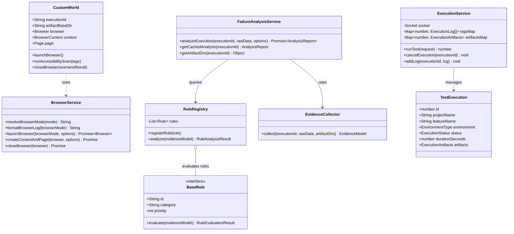
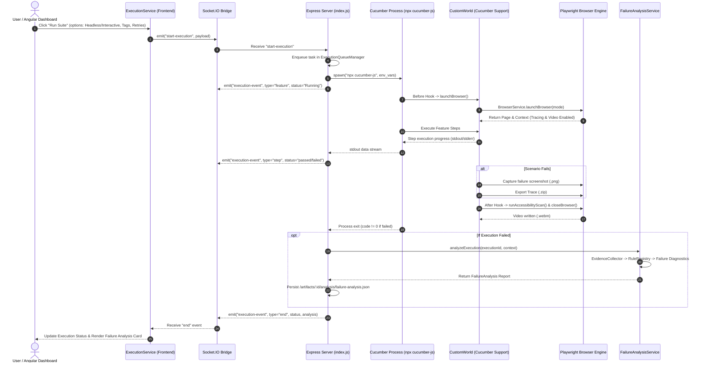
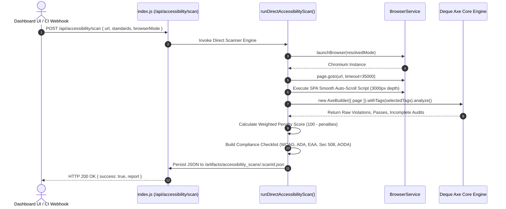
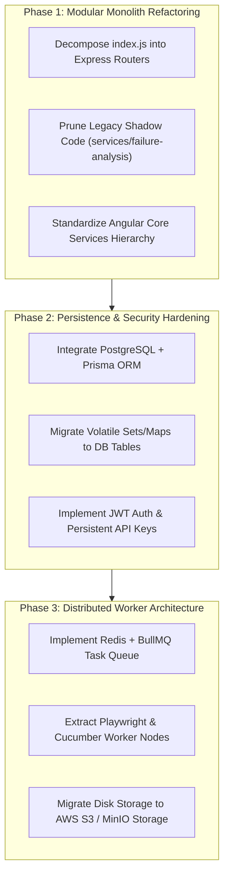

# QA Platform Architectural Blueprint & Codebase Analysis

> [!NOTE]
> This document provides a comprehensive architectural audit, static analysis, component decomposition, data flow analysis, and strategic roadmap for the **QA Platform** (`D:\Learning\qa-platform`).

---

## 1. System Overview & Component Breakdown

The **QA Platform** is an enterprise-grade automated testing, WCAG accessibility auditing, and AI-assisted failure diagnostic platform. It consists of two main decoupled projects:
1. **`qa-backend`**: Node.js/Express service orchestrating Cucumber test execution, Playwright browser automation, Deque Axe Core accessibility scanning, Socket.IO real-time telemetry, and rule-based AI failure analysis.
2. **`qa-test-execution-dashboard`**: Angular 19 SPA delivering a responsive management dashboard for running test suites, inspecting media artifacts (screenshots, WebM videos, Playwright traces), reviewing WCAG compliance reports, monitoring CI/CD webhooks, and visualizing AI failure diagnostics.

```
D:\Learning\qa-platform
├── qa-backend                           # Backend Microservice Layer (Express + Socket.IO + Playwright)
│   ├── bin/qa-platform.js               # CLI Entry Executable
│   ├── ci-templates/gitlab-ci.yml       # CI/CD Pipeline Automation Schema
│   ├── features/                        # Gherkin Feature Specifications (.feature)
│   ├── services/
│   │   ├── ai/                          # Modern Modular AI Diagnostic Engine
│   │   │   ├── failure-analysis/        # Failure Analysis Service, Registry & Rules Engine
│   │   │   └── shared/                  # Evidence Collector, Normalizer, AI Provider Factory
│   │   ├── browser/                     # Playwright Lifecycle Management & Mode Resolver
│   │   └── failure-analysis/            # [LEGACY / SHADOW] Unused monolithic failure service
│   ├── steps/                           # Cucumber Step Definitions & CustomWorld Lifecycle
│   ├── support/                         # Global Socket.IO Emitter & Shared State
│   └── index.js                         # [MONOLITH] Primary Application Server & REST/Socket Handler
└── qa-test-execution-dashboard          # Frontend SPA (Angular 19 + Angular Material)
    └── src/app/
        ├── core/                        # Data Models & Global Core Services
        ├── layout/                      # Navigation Shell & Shell Header Layout
        ├── pages/                       # Standalone Feature Pages (Dashboard, Projects, Execution, etc.)
        ├── services/                    # Additional Service Layer (LogsService)
        └── shared/                      # Reusable UI Components (AIFailureCard)
```

---

### Component Breakdown Table

| Subsystem / Module | Technology Stack | Primary Responsibility | Architectural Layer |
| :--- | :--- | :--- | :--- |
| **Angular Dashboard** | Angular 19, RxJS, Angular Material | User interface for triggering test runs, viewing real-time logs, exploring WCAG accessibility metrics, configuring webhooks. | Presentation Layer |
| **Express REST API** | Express 5, CORS | Exposes REST endpoints for execution cancellation, artifact retrieval, accessibility scans, reporting summary, and CI/CD webhooks. | API Gateway / Controller Layer |
| **Socket.IO Bridge** | Socket.IO 4 | Real-time bi-directional event stream for live log streaming, step status updates, artifact notifications, and WCAG scan progress. | Real-Time Transport Layer |
| **Cucumber Runner Engine** | `@cucumber/cucumber` 12, Node `child_process.spawn` | Executes Gherkin feature files, initializes Playwright contexts, parses Cucumber JSON output, and emits scenario results. | Test Execution Layer |
| **Playwright Browser Service**| `playwright` 1.59 | Manages Chromium browser lifecycle, handles Headless vs Interactive display modes, records WebM videos, and generates trace archives. | Browser Automation Layer |
| **Deque Accessibility Engine**| `@axe-core/playwright` 4.12 | Executes WCAG 2.1/2.2 AA, ADA Title III, EAA, Section 508, and AODA compliance rules, computing weighted penalty scores (0-100). | QA Audit & Compliance Layer |
| **AI Failure Analysis Engine**| Custom Rule Engine / Heuristic Rules | Analyzes failed execution stack traces, logs, and screenshots; classifies root causes; provides targeted remediations. | Intelligence Layer |

---

## 2. System Architecture Diagrams

### 2.1 Component Architecture Diagram

```mermaid
graph TB
    subgraph Frontend["qa-test-execution-dashboard (Angular 19 SPA)"]
        UI_Dash["Dashboard Page"]
        UI_Exec["Execution Runner"]
        UI_Detail["Execution Detail View"]
        UI_A11y["Accessibility Page"]
        UI_Cicd["CI/CD & Webhooks Page"]
        
        ExecSvc["ExecutionService"]
        ReportSvc["ReportService"]
        SocketClient["Socket.io Client"]
        
        UI_Exec --> ExecSvc
        UI_Detail --> ExecSvc
        UI_A11y --> ExecSvc
        ExecSvc --> SocketClient
    end

    subgraph Backend["qa-backend (Node.js / Express 5)"]
        API["Express REST Server (index.js)"]
        SocketServer["Socket.IO Server"]
        QueueMgr["ExecutionQueueManager"]
        
        subgraph Services["Backend Services Layer"]
            BrowserSvc["BrowserService (Playwright)"]
            A11yEngine["Direct Accessibility Scanner Engine"]
            CucRunner["Cucumber Process Runner"]
        end
        
        subgraph AISubsystem["AI Failure Diagnostics Subsystem"]
            AIFacade["FailureAnalysisService Facade"]
            EvidenceCollector["EvidenceCollector"]
            RuleReg["RuleRegistry"]
            AiOrchestrator["AI Orchestrator & Provider Factory"]
        end
        
        API --> QueueMgr
        SocketServer <--> SocketClient
        API <--> SocketServer
        QueueMgr --> CucRunner
        API --> A11yEngine
        
        CucRunner --> BrowserSvc
        A11yEngine --> BrowserSvc
        
        CucRunner -- On Failure --> AIFacade
        API -- /api/executions/:id/analyze --> AIFacade
        AIFacade --> EvidenceCollector
        AIFacade --> RuleReg
        AIFacade --> AiOrchestrator
    end

    subgraph Storage["Disk Artifacts Storage"]
        ArtScreenshots["/artifacts/:id/screenshots/"]
        ArtVideos["/artifacts/:id/videos/"]
        ArtTraces["/artifacts/:id/traces/"]
        ArtA11y["/artifacts/accessibility_scans/"]
        ArtAI["/artifacts/:id/analysis/failure-analysis.json"]
    end

    CucRunner --> ArtScreenshots
    CucRunner --> ArtVideos
    CucRunner --> ArtTraces
    A11yEngine --> ArtA11y
    AIFacade --> ArtAI
    API --> Storage
```



---

### 2.2 Domain & Core Class Hierarchy Diagram



---

## 3. Data Flow & Control Path Analysis

### 3.1 Scenario Test Execution Sequence



---

### 3.2 Direct Accessibility Audit Control Flow



---

## 4. Architectural Health Audit

> [!CAUTION]
> The architectural health audit evaluates clean code compliance, modular separation, design pattern adherence, code smells, and scalability risks.

### 4.1 System Strengths
- **Clean Angular Architecture**: Angular 19 standalone components paired with RxJS reactive state (`BehaviorSubject` maps) ensure decoupled component communication.
- **Robust Multi-Standard Accessibility Audit**: Leverages Deque Axe Core with tailored tag matrices (WCAG 2.1/2.2, Section 508, ADA Title III, EAA, AODA) and weighted scoring formulas.
- **Comprehensive Media Artifact Collection**: Automated capture of full-page screenshots on failure, Playwright zip trace bundles for step-by-step DOM debugging, and WebM video recordings.
- **Rule-Driven AI Diagnostic Engine**: The modern `services/ai/failure-analysis` directory implements a clean Strategy & Rule Registry pattern for zero-cost, deterministic root-cause analysis with pluggable LLM fallback capabilities.

---

### 4.2 Critical Architectural Risks & Code Smells

#### 1. Monolithic Express Controller Anti-Pattern (`index.js`)
- **Issue**: `qa-backend/index.js` spans **1,364 lines** and combines routing, socket handlers, process spawning logic, Cucumber JSON parsing, WCAG scanning engines, webhook telemetry history, API key authentication, and reporting aggregation into a single file.
- **Impact**: Violates Single Responsibility Principle (SRP). High risk of regression when adding features; difficult to unit test isolated components.

#### 2. Duplicate / Shadow Codebase Redundancies
- **Issue**: Two parallel failure analysis directories exist:
  1. Active: `qa-backend/services/ai/failure-analysis/`
  2. Shadow: `qa-backend/services/failure-analysis/` (Contains legacy `rule-engine.js`, `provider-factory.js`, `llm-provider.js`).
  Similarly, frontend services have `src/app/core/services/` alongside `src/app/services/logs.service.ts`.
- **Impact**: Code duplication increases developer confusion, maintenance overhead, and risk of dead code references.

#### 3. In-Memory Volatile State Storage
- **Issue**: `activeProcesses` (Map), `webhookHistory` (Array), `activeApiKeys` (Set), and `ExecutionQueueManager` (Array) reside purely in Node.js process memory.
- **Impact**: Node process crashes or restarts cause complete loss of CI/CD webhook telemetry logs, active execution states, generated API keys, and queue items.

#### 4. Tight OS Process Spawning & File System Coupling
- **Issue**: Executing Cucumber tests via `child_process.spawn('npx cucumber-js')` writes temporary uploaded feature files directly to disk (`tmp_runs/qa-run-ID`).
- **Impact**: Disk I/O bottlenecks during concurrent execution bursts; impossible to scale horizontally across multiple worker nodes without a shared file system.

#### 5. Absence of Persistent Database Layer
- **Issue**: Execution history, test trend analytics, and flaky test matrices rely on file directory listing (`fs.readdirSync`) or hardcoded/mocked datasets instead of a database engine.
- **Impact**: Prevents long-term analytical tracking, historical querying, and cross-team audit logging.

---

## 5. Strategic Recommendations for QA Platform Scaling



---

### Quantitative Scaling & Refactoring Action Plan

| Recommendation ID | Category | Target Module | Recommended Action | Priority |
| :--- | :--- | :--- | :--- | :--- |
| **REC-01** | Refactoring | `qa-backend/index.js` | Extract route handlers into `src/routes/` (`executions.routes.js`, `accessibility.routes.js`, `webhooks.routes.js`, `reports.routes.js`) and socket events into `src/sockets/`. | **HIGH** |
| **REC-02** | Maintenance | `services/failure-analysis` | Safely remove legacy duplicate directory `qa-backend/services/failure-analysis/` and keep `services/ai/`. | **HIGH** |
| **REC-03** | Architecture | Backend Storage | Replace in-memory arrays/maps with **PostgreSQL** or **MongoDB** database for executions, telemetry, and API keys. | **CRITICAL** |
| **REC-04** | Scalability | Runner Engine | Migrate `ExecutionQueueManager` to a **Redis + BullMQ** distributed queue. Dispatch runs to isolated Docker container workers. | **HIGH** |
| **REC-05** | Cloud / Infra | Artifact Serving | Upload screenshots, WebM videos, and trace zips directly to **AWS S3 / MinIO** object storage using pre-signed S3 URLs. | **MEDIUM** |
| **REC-06** | Testing | Test Suite | Implement comprehensive unit test coverage (`Jest` / `Vitest`) for `RuleRegistry`, `BrowserService`, and Express API endpoints. | **MEDIUM** |
