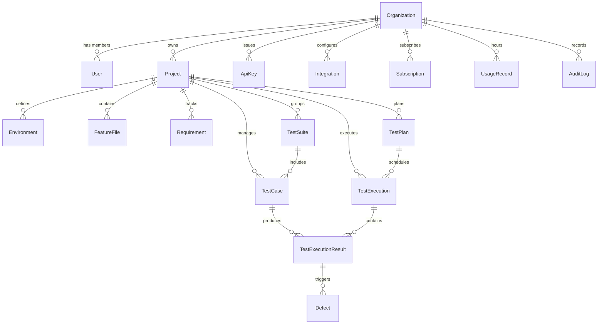

# Database Migration Plan: JSON Filesystem to PostgreSQL (Prisma ORM)

> **Document Version:** 1.0.0  
> **Target System:** AI QA Automation Platform (`qa-backend`)  
> **Objective:** Transition core entity storage from local flat JSON files (`data/projects.json`, `data/features.json`) and volatile in-memory state arrays to a robust multi-tenant PostgreSQL relational database managed by Prisma ORM.

---

## 1. Current Storage Architecture

Currently, `qa-backend` manages state through three separate storage mechanisms:
1. **Flat File JSON Databases:**
   - [`data/projects.json`](file:///d:/Learning/qa-platform/qa-backend/data/projects.json): Managed by `services/project.service.js`. Holds array of project objects (`id`, `name`, `baseUrl`, `browser`, `username`, `password`).
   - [`data/features.json`](file:///d:/Learning/qa-platform/qa-backend/data/features.json): Managed by `services/feature.service.js`. Holds metadata array (`id`, `projectId`, `name`, `updatedAt`). Linked with raw `.feature` files in `features/`.
2. **Volatile In-Memory Server Maps (in `index.js`):**
   - `webhookHistory`: In-memory JavaScript array storing CI/CD trigger history & webhook events.
   - `apiKeys`: In-memory list storing API authentication keys (`X-API-Key`).
   - `activeProcesses` & `executionStatuses`: In-memory maps tracking active Cucumber worker process handles and transient execution statuses.
3. **Local File Artifact Directories (`artifacts/` & `data/history/`):**
   - `/artifacts/:executionId/` (Screenshots, WebM videos, Playwright trace `.zip` archives, `failure-analysis.json`).
   - `/artifacts/accessibility_scans/:scanId.json` (Axe Core WCAG audit reports).
   - `/data/history/healing/` (DOM snapshots and healing candidate log files).

---

## 2. All Existing JSON & Memory Entities

| Current Storage Location | Entity Name | Schema / Fields | Usage in Backend |
| :--- | :--- | :--- | :--- |
| `data/projects.json` | Project | `id` (int), `name` (string), `baseUrl` (string), `browser` (string), `username` (string), `password` (string) | CRUD endpoints `/api/projects` via `ProjectService`. |
| `data/features.json` + `features/*.feature` | FeatureFile | `id` (int), `projectId` (int), `name` (string), `updatedAt` (iso string), `content` (string from disk) | CRUD endpoints `/api/features` via `FeatureBackendService`. |
| In-Memory (`index.js`) | ApiKey | `id` (string), `key` (string), `name` (string), `createdAt` (iso string), `status` (string) | Validated by API key routes `/api/v1/auth/keys`. |
| In-Memory (`index.js`) | WebhookHistory / ExecutionTelemetry | `triggerId` (string), `sourceOrigin` (string), `feature` (string), `tags` (string), `environment` (string), `status` (string), `timestamp` (iso string) | Read by `/api/webhooks/history` and telemetry APIs. |
| Disk (`artifacts/accessibility_scans/`) | AccessibilityReport | `scanId` (string), `url` (string), `targetTitle` (string), `scanTime` (iso string), `score` (int), `summary` (object), `violations` (array) | Scanned and read by `/api/accessibility/*`. |

---

## 3. Proposed PostgreSQL Entities (Prisma Schema Design)

To lay the foundation for enterprise multi-tenancy and full platform capabilities, the PostgreSQL schema will define the following 18 entities:

1. **`Organization`**: Multi-tenant boundary account.
2. **`User`**: System platform user belonging to an organization.
3. **`Project`**: QA project workspace tied to an organization.
4. **`Environment`**: Deployment environment (QA, Staging, Production) per project.
5. **`FeatureFile`**: Gherkin BDD feature specification linked to a project.
6. **`Requirement`**: Product requirement or Jira acceptance criteria.
7. **`TestCase`**: Manual and automated test case definition.
8. **`TestSuite`**: Logical group of test cases / features.
9. **`TestPlan`**: Sprint or release test execution plan.
10. **`TestExecution`**: Single execution run instance (suite run, CLI trigger, or manual run).
11. **`TestExecutionResult`**: Individual scenario/step pass/fail result with logs and artifacts.
12. **`Defect`**: Bug/defect tracking record linked to failed execution results.
13. **`ApiKey`**: CI/CD authentication token associated with an organization.
14. **`Integration`**: Third-party integration configurations (GitHub, Jira, Slack).
15. **`Notification`**: Outbound alert notification log.
16. **`AuditLog`**: System security and entity modification audit trail.
17. **`UsageRecord`**: Metered usage tracking (execution minutes, AI token count).
18. **`Subscription`**: Tenant billing tier and subscription status.

---

## 4. Entity Relationships Diagram (Mermaid)

---

## 5. Primary Keys, Foreign Keys & Database Indexes

### Key Guidelines:
- All models will use CUID / UUID string primary keys (`@id @default(cuid())`) for global uniqueness across multi-tenant environments.
- Every tenant-owned model will contain `organizationId String` indexed with composite indexes.

| Entity | Primary Key | Foreign Keys | Indexes |
| :--- | :--- | :--- | :--- |
| `Organization` | `id` (cuid) | None | `slug` (unique) |
| `User` | `id` (cuid) | `organizationId` -> `Organization(id)` | `email` (unique), `[organizationId, email]` |
| `Project` | `id` (cuid) | `organizationId` -> `Organization(id)` | `[organizationId, name]`, `[organizationId, createdAt]` |
| `Environment` | `id` (cuid) | `organizationId`, `projectId` -> `Project(id)` | `[projectId, name]` |
| `FeatureFile` | `id` (cuid) | `organizationId`, `projectId` -> `Project(id)` | `[projectId, name]`, `[organizationId]` |
| `Requirement` | `id` (cuid) | `organizationId`, `projectId` -> `Project(id)` | `[projectId, externalKey]` |
| `TestCase` | `id` (cuid) | `organizationId`, `projectId`, `featureFileId` | `[projectId, automationStatus]` |
| `TestExecution` | `id` (cuid) | `organizationId`, `projectId`, `environmentId` | `[projectId, createdAt]`, `[organizationId, status]` |
| `TestExecutionResult` | `id` (cuid) | `organizationId`, `executionId`, `testCaseId` | `[executionId, status]` |
| `ApiKey` | `id` (cuid) | `organizationId` -> `Organization(id)` | `key` (unique), `[organizationId]` |
| `AuditLog` | `id` (cuid) | `organizationId`, `userId` | `[organizationId, createdAt]` |

---

## 6. Organization & Multi-Tenancy Strategy

1. **Default Seed Tenant:** During Phase 1 database bootstrapping, a default system organization (`Default Organization`, slug: `default-org`) will be seeded in PostgreSQL.
2. **Schema Level Isolation:** Every entity (except global system metadata) includes `organizationId`.
3. **Backend Context Injection:** `DatabaseService` and repository functions will automatically scope queries by `organizationId`. In future Phase 2 JWT middleware, `organizationId` will be extracted directly from the authenticated request token rather than relying on frontend input.

---

## 7. Migration Strategy

1. **Prisma Setup:** Install `@prisma/client` and `prisma` CLI in `qa-backend`.
2. **Schema Creation:** Write `prisma/schema.prisma` defining PostgreSQL data structures.
3. **Migration Execution:** Run `npx prisma migrate dev --name init_database_foundation` to apply schema to PostgreSQL.
4. **Database Client Singleton:** Implement `src/services/db.service.js` wrapping `PrismaClient` with automatic connection management and default tenant resolution.
5. **Service Layer Refactoring:**
   - Refactor `services/project.service.js` to delegate project queries and mutations to Prisma `db.project`.
   - Refactor `services/feature.service.js` to delegate feature metadata and contents to Prisma `db.featureFile`.
   - Update `index.js` webhooks and API key endpoints to read/write from `db.apiKey` and `db.testExecution`.

---

## 8. Backward Compatibility Strategy

- **API Contract Preservation:** All existing REST endpoints (`GET/POST/PUT/DELETE /api/projects`, `GET/POST/DELETE /api/features`, `GET /api/v1/auth/keys`, `POST /api/webhooks/trigger-test`, `GET /api/reports/summary`) will maintain **100% identical request and response payloads**.
- **Frontend Zero-Downtime:** The Angular 19 dashboard will interact with the exact same JSON response shapes, ensuring zero visual or functional breaking changes.
- **Artifact Compatibility:** Disk-based video recording, Playwright trace generation (`.zip`), screenshots, and Axe Core accessibility scan JSON outputs in `/artifacts` will remain unchanged.

---

## 9. Data Migration Strategy (JSON → PostgreSQL)

A dedicated one-time migration script `scripts/migrate-json-to-db.js` will execute automatically on boot:
1. Creates `Default Organization` if not present.
2. Reads existing records from `data/projects.json`. Upserts into PostgreSQL `Project` table.
3. Reads existing feature metadata from `data/features.json` and `.feature` files from `features/`. Upserts into PostgreSQL `FeatureFile` table.
4. Reads initial API keys and populates `ApiKey` table.

---

## 10. Risks & Mitigation Matrix

| Identified Risk | Impact | Mitigation Strategy |
| :--- | :--- | :--- |
| **PostgreSQL Connection Failure** | High | Fall back gracefully with clear error logging if `DATABASE_URL` is unreachable; provide automated Docker Compose / local setup documentation. |
| **Numeric ID vs CUID Discrepancy** | Medium | Map legacy numeric IDs (`id: 1, 2, 3`) in REST responses if legacy clients expect integer IDs, while maintaining CUID primary keys in PostgreSQL. |
| **Feature File Desynchronization** | Medium | Store raw Gherkin text directly in `FeatureFile.content` in PostgreSQL, while keeping optional filesystem sync for execution engine compatibility. |
| **Regression in Execution Engine** | High | Keep Cucumber execution engine spawning, Socket.IO live logging, and artifact creation completely decoupled from DB storage layers. |
