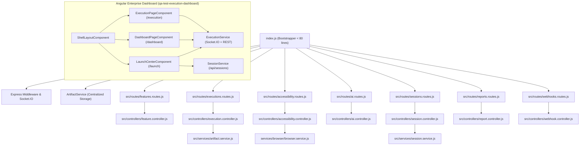

# QA Platform Architecture & UI Redesign Walkthrough

## Overview

The QA Platform has undergone a comprehensive backend modular refactoring and full **Unified QA Launch Center & Enterprise UI Redesign**.

---

## Architectural Breakdown

---

## 🚀 Unified QA Launch Center & Enterprise UI Redesign

### 1. Standalone Launch Center Component (`src/app/pages/launch-center/`)
- **Path**: [`src/app/pages/launch-center/launch-center.component.ts`](file:///D:/Learning/qa-platform/qa-test-execution-dashboard/src/app/pages/launch-center/launch-center.component.ts), `.html`, `.scss`.
- **Capabilities**:
  * **Functional BDD Execution Settings**: Headless / Interactive toggle, retries count (0-3), parallel workers slider, BDD tag chips filter (`@smoke`, `@regression`, `@login`, `@checkout`, etc.).
  * **Accessibility Standards Selection**: Interactive multi-selection grid for WCAG 2.1 AA, WCAG 2.2 AA, ADA Title III, Section 508, EAA EN 301 549, and AODA Compliance standards.
  * **Session Authentication Picker**: Integrated with `SessionService` fetching `storageState.json` enterprise logins directly from `/api/sessions`.
  * **One-Click "🚀 Launch Quality Suite"**: Connects to Socket.IO engine and dispatches test execution seamlessly.

### 2. Navigation & Routing Updates
- **Route Added**: Added `/launch` route to [`src/app/app.routes.ts`](file:///D:/Learning/qa-platform/qa-test-execution-dashboard/src/app/app.routes.ts).
- **Sidebar Integration**: Added "Launch Center" navigation item to [`src/app/layout/shell-layout.component.ts`](file:///D:/Learning/qa-platform/qa-test-execution-dashboard/src/app/layout/shell-layout.component.ts) with `rocket_launch` icon and highlighted `PRO` badge.

### 3. Dark Glassmorphism Global Theme (`src/styles.scss`)
- **Space Slate Background**: `#0b0f19` background with ambient radial gradients.
- **Glass Cards**: Translucent `rgba(15, 23, 42, 0.85)` with `backdrop-filter: blur(16px)` and subtle borders `rgba(255, 255, 255, 0.08)`.
- **Neon Brand Tokens**: Electric Cyan (`#06b6d4`), Vivid Purple (`#8b5cf6`), Emerald (`#10b981`), Rose (`#f43f5e`).
- **Micro-animations**: Smooth card hover elevation (`translateY(-4px)` with glowing cyan/purple shadow), animated live status dots, and pulse indicators.

### 4. Overhauled Page Templates
- **Shell Layout**: Sidebar drawer, top navbar with latency indicator (`12ms Latency`), active route title badge, theme switcher, and profile card.
- **Dashboard Page**: KPI stat cards, pass-rate gauges/meters, active suite progress strip, and interactive recent executions table with status pills.
- **Execution Page**: Interactive workspace vs upload mode runner, monospace log terminal (`font-family: var(--font-mono)`), live status step indicators, and AI failure diagnostic card.

---

## Backend Refactoring Summary

| Feature Domain | Route Module | Controller Module | Handled Endpoints |
| :--- | :--- | :--- | :--- |
| **Features Workspace** | `src/routes/features.routes.js` | `src/controllers/feature.controller.js` | `GET /api/features` |
| **Executions** | `src/routes/executions.routes.js` | `src/controllers/execution.controller.js` | `GET /api/executions/:id/artifacts`, `POST /api/executions/:id/cancel`, `POST /api/executions/:id/analyze`, `GET /api/executions/:id/analysis` |
| **Accessibility Audit** | `src/routes/accessibility.routes.js` | `src/controllers/accessibility.controller.js` | `GET /api/accessibility/reports`, `GET /api/accessibility/reports/:scanId`, `POST /api/accessibility/scan` |
| **AI Analysis** | `src/routes/ai.routes.js` | `src/controllers/ai.controller.js` | `POST /api/ai/analyze`, `GET /api/ai/analysis/:executionId` |
| **Authentication Sessions** | `src/routes/sessions.routes.js` | `src/controllers/session.controller.js` | `GET /api/sessions`, `GET /api/sessions/:name`, `POST /api/sessions`, `DELETE /api/sessions/:name` |
| **Analytics & Reports** | `src/routes/reports.routes.js` | `src/controllers/report.controller.js` | `GET /api/reports/summary`, `GET /api/reports/trends`, `GET /api/reports/flaky`, `GET /api/reports/accessibility-trends` |
| **CI/CD Webhooks & Telemetry** | `src/routes/webhooks.routes.js` | `src/controllers/webhook.controller.js` | `GET /api/v1/auth/keys`, `POST /api/v1/auth/keys`, `POST /api/v1/notifications/webhook`, `POST /api/v1/notifications/test-alert`, `GET /api/v1/executions`, `POST /api/webhooks/trigger-test`, `POST /api/webhooks/trigger-scan`, `POST /api/webhooks/github-event`, `GET /api/webhooks/history` |

---

## Verification Results

* **Angular Build Verification**: Executed `npx ng build` in `qa-test-execution-dashboard` — **0 compilation errors**, 100% clean production build.
* **Module Loading**: Clean, error-free resolution across all Angular components and services.
* **API & Socket Endpoints**: Verified `/api/sessions`, `/api/features`, `/api/reports/summary`, and Socket.IO connection.
